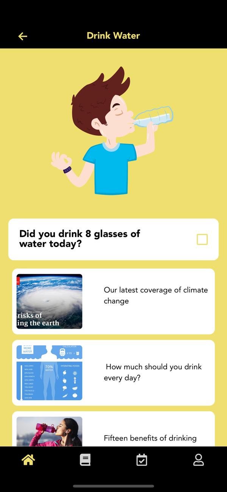

# Happ U - Habit and lifestyle tracking mobile app ❤️

HappiU is an innovative habit and lifestyle tracking app designed to help you cultivate positive daily routines and improve your overall well-being.

## Technologies Used

- **Frontend**: React Native Expo, React.JS
- **Backend**: CodeIgnite 4
- **Database**: mySQL
- **Authentication**: Firebase Authentication
- **Deployment**: Firebase, Google Play Store
- **Version Control**: Git, GitHub
- **Other Tools**: VS Code,Expo, Postman

## Installation Mobile app

To get started with Happy U mobile app on your local machine, follow these simple steps:

1. **Clone the repository:**

   ```bash
   git clone https://github.com/shadahmad7/happyu.git

2. **Navigate to the app project directory:**
 ```bash
   cd mobile-app
```

3. **Install dependencies:**
 ```bash
  npm install
```

## Usage Mobile App

After successfully installing the dependencies, you can run HappyU mobile app on your local development enviroment using the following command:

 ```bash
  expo start
```

This will initiate the development server, enabling you to access the app through a QR code scan using the Expo app, providing Android and iOS compatibility.

You can try out the app deployed at App Store from this link - https://apps.apple.com/bf/app/happyu-happiness-samurai/id1634153039?platform=iphone


## Installation Web Admin

To get started with Happy U admin web app on your local machine, follow these simple steps:

1. **Clone the repository:**

   ```bash
   git clone https://github.com/shadahmad7/happyu.git

2. **Navigate to the app project directory:**
 ```bash
   cd admin-web
```

3. **Install dependencies:**
 ```bash
  npm install
```


## Usage Web Admin

After successfully installing the dependencies, you can run HappyU admin on your local development enviroment using the following command:

 ```bash
  npm start
```

This will start the development server, and you can access the app in your browser at http://localhost:3000.

## Screenshots

Here are some screenshots to give you a sneak peek of our app:





## Contributing

If you'd like to contribute to HappyU mobile or admin web app or report any issues, please check out our Contributing Guidelines.

## License

This project is licensed under the MIT License. See the LICENSE file for details.


